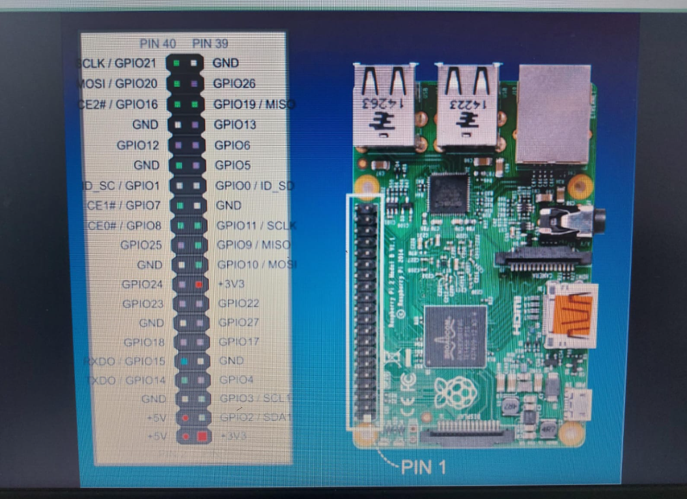
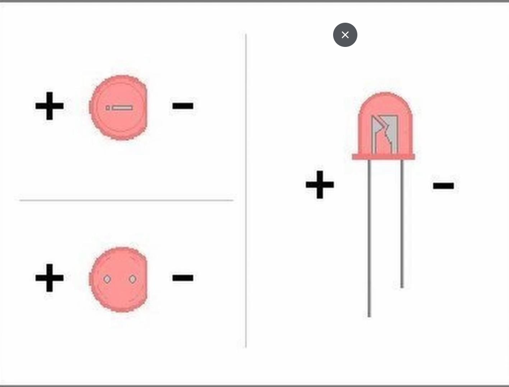
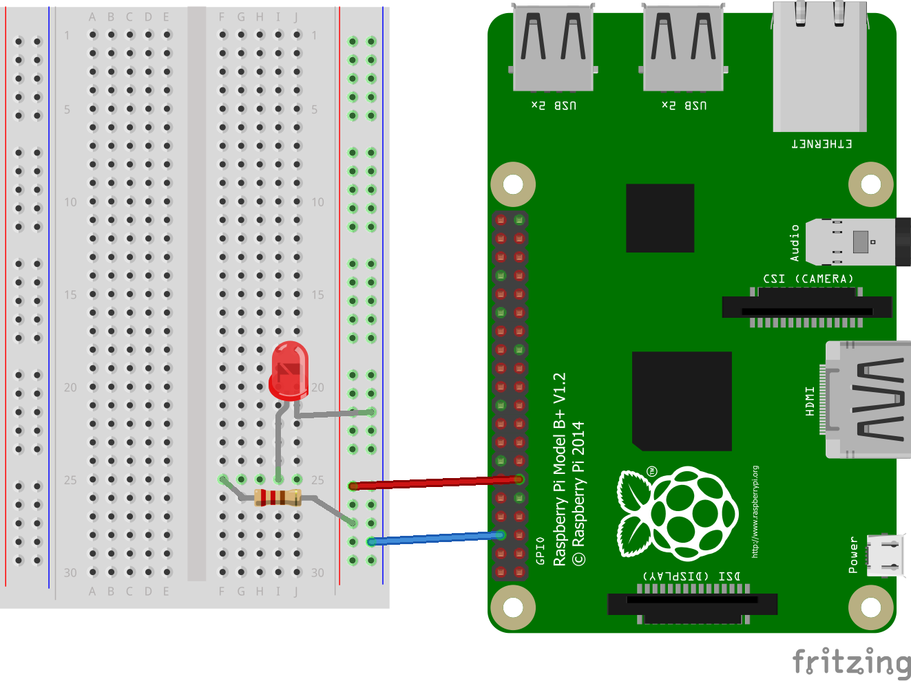

# Controlling LED with Raspberry Pi GPIO
A repositorie to control any color or more than one LED with your Raspberry Pi. From this repositorie, it'll guide and teach you from everything you need to know about LEDs. From how to get started with LEDs with your Raspberry Pi in a begginer project, to how to do fancy circuits with LEDs with your Raspberry Pi, all in step-by-step.

This repositorie should be compadable to every version of Raspberry Pi. 

Without any further do, let's dive in! :D

## Overview
➢ **What is an LED? What are LEDs used for?**  
The LED is short for Light Emitting Diode, and it's a semiconductor device that emits light when an electric current passes through it. LEDs are used for various purposes, including: lighting fixtures, displays, automotive lighting, and even medical equipment due to their energy efficiency, long lifespan, and versatility.

➢ **What does GPIO stand for?**  
Raspberry Pi GPIO pins stand for _General Purpose Input/Output_. They are used to connect with the outside world and physical objects, and they are located on the edge of the Raspberry Pi board.

➢ **Summary**  
We're going to use the Raspberry Pi GPIO pins to control the LED(s). We're going to use gpiozero module from Python to write the code, and we're going to need basic materials for the projects.

## Table of Contents
You can click on the link to go to the project you're interested in. The projects go from **easiest** to **hardest**.

- [Project #1: Make an LED Blink](#project-1-make-an-led-blink)

## Layouts
➢ **Raspberry Pi GPIO Pinout Diagram**  
Before connecting and setting anything yet, you need to understand what the pinout of your Raspberry Pi is. The Raspberry Pi GPIO pinout diagram shows you the **name of each pin** and  **information about the functions of each pin**.

You can find your Raspberry Pi GPIO pinout diagram by typing in your broswer search:

<pre>
________________ gpio pinout
</pre>

In the blank, type your Raspberry Pi version.

For example, this Raspberry Pi GPIO pinout diagram correspons to **Raspberry Pi 4** (I couldn't find the orginal image):

➢ **LED Layout**  
As you may have noticed or not, LEDs have two legs corresponding to either negative energy or positive energy. The **positive** leg is usually the one who is the **longest**, and the **negative** is the **shortest**. 

Below, there's an image showing what leg correspons to:

# Project #1: Make an LED Blink
This project is making the LED blink (turns on and off) for 5 times with a 0.5-second sleep in between. This project is great for begginers who want to get stated into using their Raspberry Pi into awesome project ideas. 

Keep in mind that **you should play and mess with it**, meaning that **you should be changing stuff (after you are done with the project) to explore and discover more**. 

## Materials
**Components**  
- 1x LED
- 2x Female/Male Jumpers
- 1x 100 ohm Resistor

**Tools/Equipment**  
- Raspberry Pi
- Micro SD Card
- Breadboard
  
## Bulding Up the Circuit
***Note:*** You may want to do this [BEFORE Building Up the Circuit](#layouts).

➢ **Final Circuit**  

➢ **Building**  
1. Connect one of the Female/Male Jumper to the GND pin.

2. Connect another Female/Male Jumper to the GPIO 17 pin.

3. Connect the GND jumper to the negative row of the breadboard (Right Side).

4. Connect the GPIO 17 jumper to the positive row of the breadboard (Right Side).

5. Grab your LED and connect it to the negative row and the 25 column (Right side).

6. Grab your resistor and connect it to the positive row and the 25 column (Right Side).

➢ **Explanation**  
This circuit is simple enough to visually see what is going on, but there are still some things that I'd like to point out to explain a little bit more.

As you can notice, we're using two different engeries (positive, negative) to light up the LED, but there's a resistor in one of the engergy wires. This is because the LED can't handle all the energy, meaning that it would damage the LED, possible leading to not working. Instead, we use a resistor (type of resistor depends on the resistance, power rating, and other factors of the circuit) to limit the current flowing through the LED. 

## Programming the Code
For this project's code, we'll be using **Python** and the **gpiozero module**. We'll be using **3 commands** 

You need to import the LED module:
<pre>
from gpiozero import LED
</pre>

Create a variable named "led" and attach the "LED(17)" value to it:
<pre>
led = LED(17)
</pre>

The 'led.on()' method turns on the LED:
<pre>
led.on()
</pre>
   
The 'led.off()' method turns off the LED:
<pre>
led.off()
</pre>

The 'led.toggle()' method turns on if it was off and vice versa:
<pre>
led.toggle()
</pre>

4 ) My Program Examples:

A. led_flash.py  
This Python script is making the LED blink (turn on and off) for 5 times with a 0.5-second sleep in between. 
